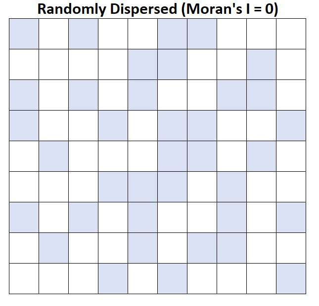
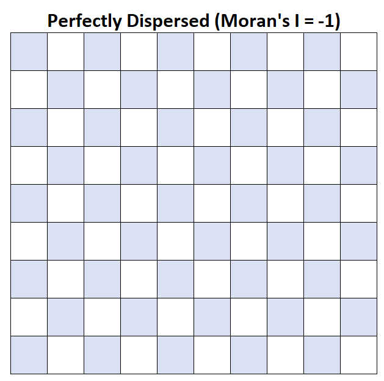
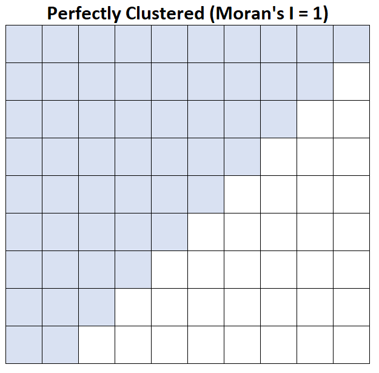
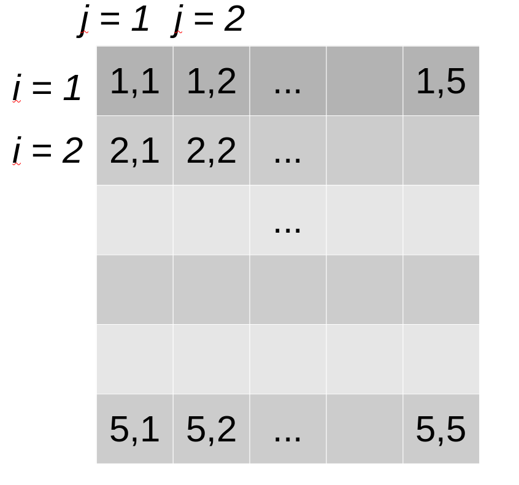
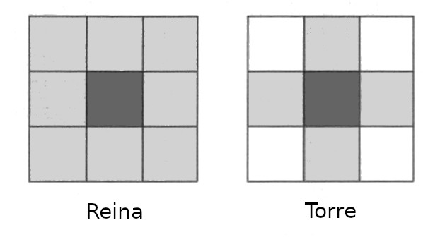

### Intro

Anteriormente:

- Asociación entre dos procesos espaciales

Ahora
  
- Asociación de un proceso con el espacio:

    - Ubicación en el plano cartesiano
    - En relación a unidades espaciales vecinas
    
### Ejemplos



### Ejemplos



### Ejemplo



### Índice **I** de Moran

Medición de la agregación de valores similares

\begin{equation}
    I = N \times W \times \sum_{i = 1}^n \sum_{j = 1}^n w_{ij} \frac{(x_i - \bar{x})(x_j - \bar{x})}{\sum (x_i - \bar{x})^2}
\end{equation}

### Índice *I* de Moran

- $N$ es el número total de unidades espaciales indizadas por $i$ y $j$
- $W$ es la suma de pesos $w_{ij}$
- $x$ es la variable de interés
- $\bar{x}$ es la media de $x$
- $w_{ij}$ es una matriz de pesos espaciales

### Indización de las unidades



### Interpretación de *I* de Moran

$I = 0$, valores son aleatorios, no hay asociación con espacio

$I = 1$, Valores están perfectamente dispersos

$I=-1$, Valores están perfectamente agregados

# Implementación en **R**

### Para datos raster

Función `Moran`, argumento: objeto que contiene capa raster

```{r echo = T , message=F, warning=F}
library(raster)
r <- raster("../Datos-ejemplos/Var-1.tif")
Moran(r)
```
### La capa analizada

```{r echo =FALSE, fig.align='center', fig.width=4, fig.height=4}
plot(r)
```

### Otro ejemplo

Reemplazaremos valores de `r` con otros de distribución uniforme:

```{r echo = TRUE}
set.seed(5934857)
r1 <- r
r1[] <- runif(ncell(r))
Moran(r1)
```
### La capa

```{r echo = F, fig.align='center', fig.width=4, fig.height=4}
plot(r1)
```

### Para puntos

```{r echo=F, fig.height=4, fig.width=4}
datos <- read.csv("../Datos-ejemplos/Datos-puntos-Moran.csv")
datos$reg <- with(datos, (Mediciones - min(Mediciones))/(max(Mediciones) - min(Mediciones)) + 0.2)
with(datos, plot(Longitud, Latitud, cex = reg))
```

### Vecindades



### Estableciendo vecindades para puntos

1. Instalación y carga de paquete:

```{r echo = T}
library(spdep)
```

```{r echo = T}
vecindad <- dnearneigh(x = as.matrix(datos[, c("Longitud", "Latitud")]), d1 = 0, d2 = 75, longlat = T)
vec.listw <- nb2listw(vecindad)
S0 <- sum(nb2mat(vecindad))
```

- `x` son las coordenadas
- `d1, d2`, distancias mínimas y máximas para considerar que puntos son vecinos
- `longlat`, si coordenadas son en grados

### Cálculo de I

Necesitamos una implementación diferente, `moran.test`:

```{r}
I.puntos <- moran.test(x = datos$Mediciones, listw = vec.listw)
```

- `x`, valores cuya correlación queremos medir

- `listw`, lista de vecindades

### Resultado

```{r echo = F}
I.puntos
```

