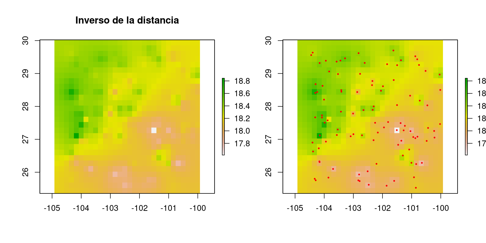
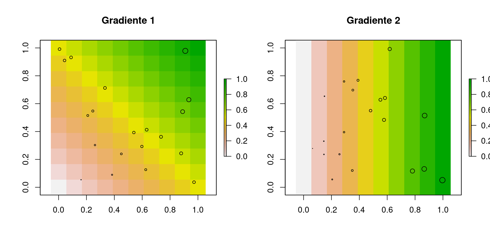

# ¿Qué es la interpolación?

### Descripción

Procedimiento analítico para predecir variabilidad de proceso espacial a partir de los valores observados y su ubicación

### Diagrama

### Ejemplo

Variable:

$$X = \{1, 2, , 4, , 6, , , 9 \}$$

Valores faltantes:

$$3, 5, 7$$

### Ejemplo en 2 dimensiones

$$\begin{matrix}
1 &   & 3 & 4 \\
  & 2 &   & 5 \\
3 & 4 & 1 & 6 \\
4 &   & 2 & 
\end{matrix}$$

### Solución 1

Hay múltiples soluciones, por ejemplo, promedio de vecinos tipo torre:

$$\begin{matrix}
1 & 2 & 3 & 4 \\
2 & 2 & 2.75 & 5 \\
3 & 4 & 1 & 6 \\
4 & 3.33 & 2 & 4
\end{matrix}$$

### Solución 2

Promedio de vecinos *existentes* tipo reina

$$\begin{matrix}
1 & 2 & 3 & 4 \\
2.4 & 2 & 3.625 & 5 \\
3 & 4 & 1 & 6 \\
4 & 2.8 & 2 & 3
\end{matrix}$$

# Técnicas utilizadas comunmente

### Vecino más próximo

Consiste en:

1. Identificar unidades espaciales más cercanas a aquellas donde contamos con mediciones
2. Asignar a esas unidades espaciales los valores de la unidad cercana

### Ejemplo de vecino más próximo

### Ejemplo de vecino más próximo

### Ejemplo de vecino más próximo

### Ejemplo de vecino más próximo

### Ejemplo de vecino más próximo

### Ejemplo de vecino más próximo

### Ejemplo de vecino más próximo

### Para muchas unidades espaciales

1. Crear teselado
2. Asignar valores a cada unidad espacial del teselado
3. Rasterizar el teselado

### Crear teselado

### El teselado

- Genera polígonos alrededor de los puntos de muestreo

- Cualquier punto dentro de los polígonos está más cerca del sitio de muestreo adentro que cualquier otro

### Vista cercana del teselado

### Vista cercana del teselado

### Vista cercana del teselado

### La interpolación

# Otras metodologías de interpolación

### Ponderada por inverso de la distancia

- En vecino más próximo se asigna mismo valor que de mediciones

- En inverso de distancia, valor es inversamente proporcional a distancia lineal

### IDW

### Regresión sobre las coordenadas

- Valores son función de coordenadas geográficas

$$y(Lat, Lon) = \alpha + \beta_1 Lat + \beta_2 Lon$$
- **Sólo sirve si el gradiente en espacio es lineal**

### RSC

### Splines

- Regresión sobre coordenadas, sonde gradiente no es lineal

- Puede ajustar relaciones muy complejas entre variable dependiente e independientes

### Splines - Ejemplo

### Ejemplo de splines

