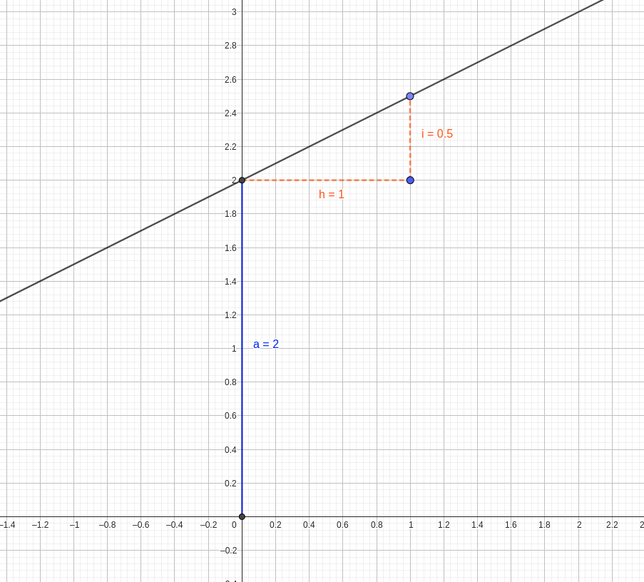

```{r setup, include=FALSE}
knitr::opts_chunk$set(dev = 'pdf')
```

### Diferencias y similitudes con correlación

- Correlación mide dependencia lineal entre dos fenómenos

- No hay causa - efecto:

    - $\mathrm{cov}(X, Y) = \mathrm{cov}(Y, X)$
    
- No permite estimar cambio de una con respecto de la otra

- Regresión, sí se asume causa y efecto:

    - $y(x) = a + bx$
    
### Diferencias y similitudes con correlación

- Correlación, sólo conocemos $r$, ó $\rho$ (correlación de Spearman)

    - Signo de $r$ indica si una disminuye ó aumenta en relación a la otra
    
    - $P$ indica probabilidad de que $r = 0$

- Regresión

    - Coeficientes $a$ y $b$ cuantifican relación entre $x$ y $y$
    
    - $a$, valor de $y$ cuando $x = 0$
    
    - $b$, aumento ó disminución de $y$ cuando $x$ aumenta en 1 unidad
    
    - $R^2$, cuadrado del coeficiete de correlación $r$
    
### Diferencias gráficas

```{r echo=F, fig.height=3, fig.width=3, fig.align='center'}
set.seed(878)
x <- rnorm(100, mean = 10, sd = 2)
y <- x + rnorm(100, mean = -5, sd = 1)

df.1 <- data.frame(x = x, y = y)

library(ggplot2)
ggplot(df.1, aes(x = x, y = y)) + geom_point(colour = "red") + 
  stat_ellipse(level = 0.95) + theme_classic()
```


### Diferencias gráficas

```{r echo = F, fig.height=3, fig.width=3, fig.align='center', warning=F, message=F}
df.1$x1 <- rnorm(rnorm(100, mean = 10, sd = 4))

ggplot(df.1, aes (x = x1, y = y)) + geom_point(colour = "red") +
  stat_ellipse(level = 0.95) + theme_classic()
```

### Diferencias gráficas

```{r echo=F, fig.height=3, fig.width=3, fig.align='center', warning=F, message=F}
set.seed(878)
x <- rnorm(100, mean = 10, sd = 2)
y <- x + rnorm(100, mean = -5, sd = 1)

df.1 <- data.frame(x = x, y = y)

library(ggplot2)
ggplot(df.1, aes(x = x, y = y)) + geom_point(colour = "red") + 
  geom_smooth(method = "lm", colour = "black", alpha = 0.5) + 
  theme_classic()
```

### Diferencias gráficas

```{r echo = F, fig.height=3, fig.width=3, fig.align='center', warning=F, message=F}
df.1$x1 <- rnorm(rnorm(100, mean = 10, sd = 4))

ggplot(df.1, aes (x = x1, y = y)) + geom_point(colour = "red") +
  geom_smooth(method = "lm", colour = "black", alpha = 0.5) + theme_classic()
```

### Significato de parámetros



### Significado de parámetros

$$y(x) = a + bx$$

- $a$ = 2

- $b = i/h = 0.5$

$$y(x) = 2 + 0.5 x$$

### Implementando en R

- Función nativa para estimar $a$, $b$ y $R^2$, `lm`

- Hipótesis que queremos rechazar, $x$ no afecta a $y$

    - $a \neq 0$, $b \neq 0$
    
- Uso:

```{r echo=T, eval=F}
lm(x ~ y, data = df.1) #df.1 es tabla que contiene datos de x y y
```

### Implementando en R

```{r}
reg.lin <- lm(y ~ x, data = df.1)
summary(reg.lin)
```

### Implementando en R

**Columnas**

- `Estimate` contiene el valor estimado

- `Pr(>|t|)` es la probabilidad de que $a = 0$ ó $b=0$

**Filas**

- $a = \mathtt{(Intercept)}$
    
- $b = \mathtt{x}$

- $R^2 = \mathtt{Adjusted\ R-squared}$

### Implementando en R

```{r}
reg.lin1 <- lm(y ~ x1, data = df.1)
summary(reg.lin1)
```


### Regresión lineal con datos espaciales

Al igual que en correlación, debemos:

1. Extraer

2. Añadir a base de coordenadas

3. Ajustar

4. Interpretar

5. Predecir

### Regresión con datos espaciales

Retomaremos el ejemplo de la correlación espacial:

```{r echo = F, warning=F, message=F}
library(terra)
r <- rast("../Datos-ejemplos/Var-1.tif") 
#Para varias capas alineadas
r <- rast(list.files("../Datos-ejemplos/", 
                      "tif", full.names = T))

set.seed(19873)
puntos <- coordinates(r)
puntos <- puntos[sample(1:nrow(puntos), 100),]
puntos <- data.frame(puntos)
puntos$x <- puntos$x + runif(100, -0.1, 0.1)
puntos$y <- puntos$y + runif(100, -0.1, 0.1)
var <- extract(r[[2]], puntos)
puntos$mediciones <- var * rnorm(1, 2, 0.1) + rnorm(100, -150, 20)
puntos <- na.omit(puntos)
knitr::kable(head(puntos), caption = "Primeras seis filas de una base de datos de mediciones colectadas en campo.")
```

### Gráfico de los valores colectados

```{r echo=F, fig.height=4, fig.width=4, fig.cap="Diámetro de burbujas indica magnitud", fig.align='center'}
plot(r[[1]])
points(puntos[, c("x", "y")], cex = puntos$mediciones/50)
```

### Extrayendo valores de capas raster

```{r echo = T}
valores.capas <- extract(r, puntos[, c("x", "y")])
puntos <- data.frame(puntos, valores.capas)
```

### Valores extraídos de capa raster

```{r echo = F}
knitr::kable(puntos[1:10, ])
```

### Ajustando el modelo lineal

Con base en análisis de correlación sabemos que es más probable que `Var.2` explique las mediciones:

```{r echo = T}
m1 <- lm(mediciones ~ Var.2, puntos)
```

### Ajustando el modelo lineal

```{r echo = T}
summary(m1)
```

### Predicción espacial

Necesitamos crear base con valores para predecir:

```{r echo = T}
val.nuevos <- data.frame(rasterToPoints(r))
preds <- predict(m1, val.nuevos)
preds.r <- rasterFromXYZ(data.frame(val.nuevos[, c("x", "y")], preds))
```

### Gráfico de la predicción

```{r echo=F, fig.height=4, fig.width=4, fig.align='center'}
plot(preds.r)
```

### Comparación con otros modelos

```{r echo = T}
m2 <- lm(mediciones ~ Var.1, puntos)
m3 <- lm(mediciones ~ Var.3, puntos)
```

### Comparación con otros modelos

```{r echo = F}
summary(m2)
```

### Comparación con otros modelos

```{r echo = F}
summary(m3)
```

### Comparación con criterio de Akaike

```{r echo = T}
AIC(m1)
AIC(m2)
AIC(m3)
```

Modelo con AIC menor, `m1`, por lo tanto, parece más adecuado que `m2` y `m3`

### Conclusión

- Regresión lineal sirve para predecir

- Correlación sirve para medir asociación
